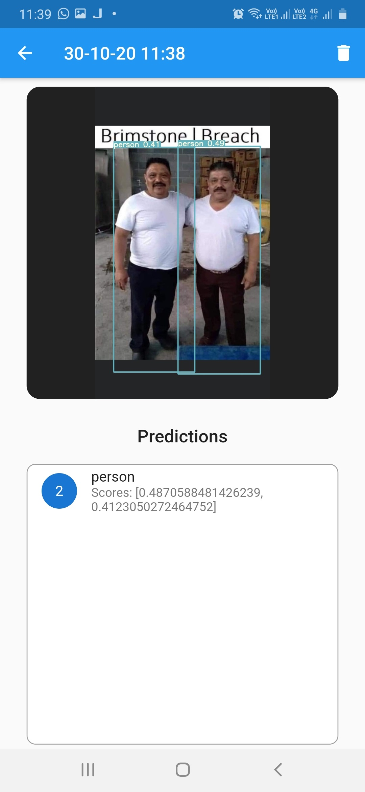

# flutter image detection app with flask restapi

  

This app is made for testing deep learning object detection models hosted using flask server.
Any object detection model is compatible with the app, the only required is changing the predict.py with your model's predict function

At app start it requires to connect to a server, uploading and predicting before connection is not possibly, app will popup an error for it and ask for connecting to the server.

App also has a filter menu to sort and filter images based on prediction count or time uploaded/predicted.

